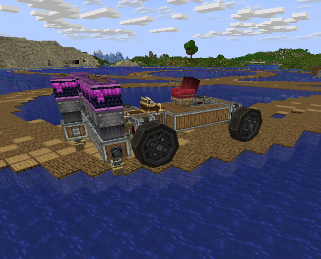

# Create World-Grid Deployer

<p align="center">
  
</p>

<p align="center">
  <a href="https://github.com/TheThouZands/create_world_grid_deployer/releases/latest">Download</a>
  ·
  <a href="https://github.com/TheThouZands/create_world_grid_deployer/wiki">Documentation</a>
</p>

A focused NeoForge compatibility patch that adds **World-Grid Use** as a third
mode for Create deployers mounted on Sable physics contraptions.

Instead of attaching placed blocks to the moving contraption, World-Grid Use
places them into the stationary world. Placement follows every crossed block
cell rather than Create's normal RPM cycle, enabling vehicle-mounted bridge
builders, tunnelers, walls, and similar machines.



## Features

- Face-connected swept placement that keeps up with fast-moving contraptions.
- Persistent third-mode state across saves, restarts, assembly, and disassembly.
- Create's normal placement rules, inventories, events, and support checks.
- World-motion-based deployer hand animation on compatible clients.
- Client-predicted overlays and optional server-authoritative outcome debugging.
- Create-styled client and server configuration screens.
- No added blocks, items, recipes, dimensions, or forced chunk loading.

## Requirements

| Component | Version |
| --- | --- |
| Minecraft | `1.21.1` |
| NeoForge | `21.1.228+` in the 21.1 line |
| Create | `>=6.0.10`, `<6.1.0` |
| Sable | `>=2.0.3`, `<2.1.0` |
| Java | 21 |

Install the release jar in the server's `mods` directory. Client installation
is strongly recommended for the proper mode label, hand animation,
configuration UI, and diagnostics, but the patch adds no synchronized registry
content and does not by itself prevent an otherwise compatible unmodded client
from joining.

## Using World-Grid Use

Use a wrench on Create's deployer mode selector to cycle:

1. Punch
2. Use
3. World-Grid Use

The mode activates only on a Sable sublevel. The deployer must have non-zero
kinetic speed, be unlocked, and hold a placeable block. Placement remains fully
server-authoritative.

## Documentation

- [Installation and compatibility](https://github.com/TheThouZands/create_world_grid_deployer/wiki/Installation)
- [World-Grid Use behavior](https://github.com/TheThouZands/create_world_grid_deployer/wiki/World-Grid-Use)
- [Debug overlays and server outcomes](https://github.com/TheThouZands/create_world_grid_deployer/wiki/Debugging)
- [Releases](https://github.com/TheThouZands/create_world_grid_deployer/releases)

## Building

The build expects matching Create and Sable jars in the directory configured by
`server_mods_dir` in `gradle.properties`.

```powershell
./gradlew.bat clean test build
```

Licensed under the [MIT License](LICENSE).
